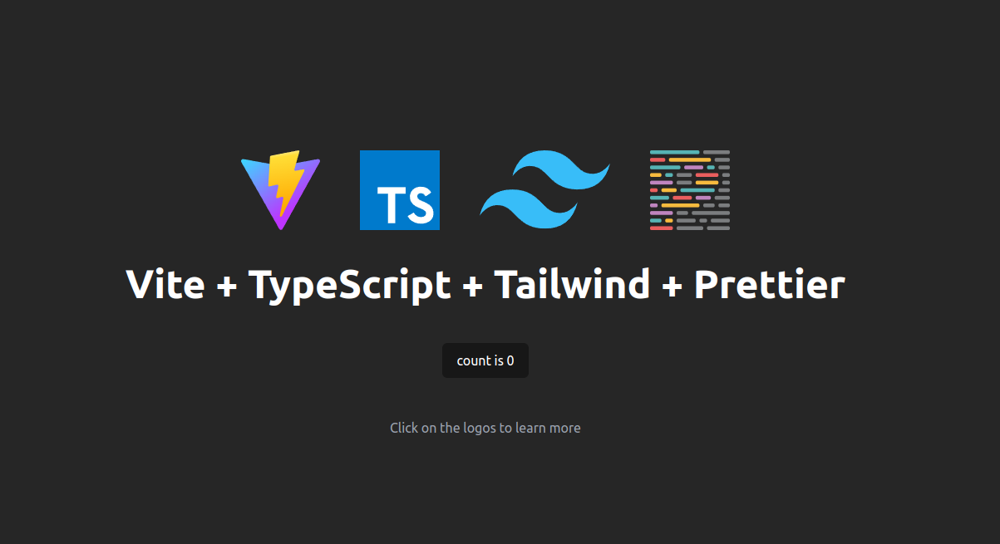

# template-vite-ts-tw_name
Vite Typescript Tailwind Template

# template-vite-ts-tw [App](https://deniszholob.github.io/template-vite-ts-tw/)

template_nx_project_description

## Deployments 

- Master branch is for the source code that's hosted on
  [GhPages](https://deniszholob.github.io/template-vite-ts-tw/)

# Support Me

If you find the cheat sheet or the source code useful, consider:

- Donating Ko-fi: https://ko-fi.com/deniszholob
- Supporting on Patreon: https://www.patreon.com/deniszholob

# Screenshots

